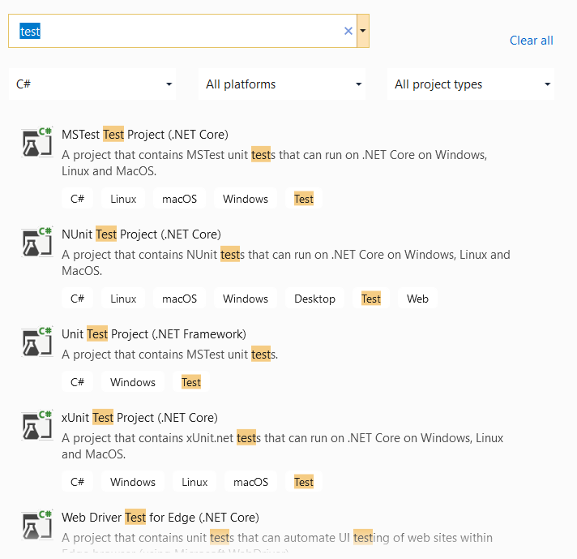
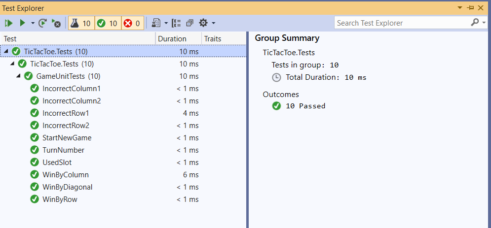
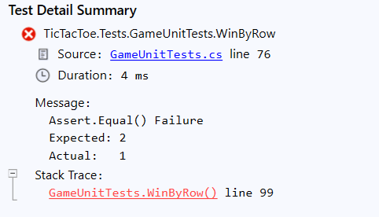
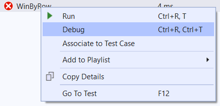

# Tic-tac-toe játék - Unit tesztek

A mintaprogramhoz készültek unit tesztek, amelyek az elvárt működést tesztelik.

## Teszt project létrehozása

Ahhoz, hogy egy programhoz/project-hez unit teszteket tudjunk írni egy új project-et kell Visual Studio-ban a solution-höz hozzáadni.

Project típus kiválasztásnál segít, ha a keresőbe beírjuk a "test" kulcsszót és a nyelvet C#-ra állítjuk. Figyeljünk, hogy a zárójelben lévő .NET Core vagy .NET Framework megegyezzen a tesztelni kívánt project típusával!



Több használható könyvtár létezik teszteléshez. Most használjuk az xUnit-ot.

Természetesen választhatsz más könyvtárat is teszteléshez, ekkor olvass utánna, hogy hogy kell összerakni a tesztkörnyezetet, hogy tudod futtatni a teszteket és megnézni az eredményeket!


## Tesztek írása

Létrejött az új project egy új fájllal benne egy unit teszt skeletonnal. Ez egy jó kiindulási váz, tesztek írásához.

Egy bizonyos funkció csoportot/osztályt tesztelő tesztesetek jó, ha egy unit teszt fájlba/osztályba kerülnek. Az egyes funkciókat, eseteket jó, ha külön tesztesetekbe szervezzük.

Ahhoz, hogy a saját kódunkat tesztelni tudjuk azt be kell hivatkoznunk a teszt project-be is. Ehhez a következőt kell tenni: teszt project-en jobb klikk, Add, Reference... A megjelenő ablakban a solution kategóriából válasszuk ki a tesztelni kívánt project-et.

xUnit-nál 1-1 tesztesetet leíró függvény elé tett ```[Fact]``` annotáció jelzi, hogy ez egy konkrét teszteset.

```Assert``` teszi lehetővé, hogy az elvárt és ténylegesen állapotot össze tudjuk hasonlítani. Leggyakrabban használt assert függvények az ```Assert.Equal();```, ```Assert.True();```, ```Assert.Contains();```. De akár kivételkezelés tesztelésére ```Assert.Throws();``` is használható.

Ne feledjük a unit tesztek felépítésére vonatkozó hármast: Arrange-Act-Assert.
- Arrange: kiindulási állapot elkészítése
- Act: valamilyen művelet végrehajtása, aminek a helyességére kíváncsiak vagyunk
- Assert: az elvárt és a ténylegesen kapott eredmény összehasonlítása, ellenőrzése

## Tesztek futtatása

Egy pár ilyen teszt készült a Tic-tac-toe játékhoz. Most nézzük meg, hogyan tudjuk a teszteket lefuttatni és megnézni az eredményt.

Egy lehetőség, hogy a teszt project-re jobb klikk és Run tests. Ekkor megjelenik a Test Explorer-ben az eredmény.



Másik lehetőség, hogy a Test Explorer-ből indítjuk a teszteket. Ilyenkor ki is választhatjuk, hogy minden tessztet, csak az eddigi sikertelen teszteket vagy esetleg egy konkrét tesztet szeretnénk futtatni.

## Hibás tesztet debug-olása

Most szándékosan "rontsuk el" az egyik tesztet és nézzük, hogy így milyen eredményt kapunk.
A ```WinByRow``` eset levgégén ne az 1-es hanem a 2-es számú játékos legyen a nyertes. (```Assert.Equal(2, game.Winner); ```)

Ahogy vártuk, a teszt jelzi, hogy itt valami nem oké, nem egyezik az elvárt és a tényleges érték. Megkapjuk, hogy hol van a probléma.



Degub módban is tudjuk a teszteket indítani. Tegyünk break point-okat a tényleges kódba és indítjuk a tesztet debug módban. Így megnézhetjük debug módban is, hogy mi történik ténylegesen, ki tudjuk javítani a "hibát".


